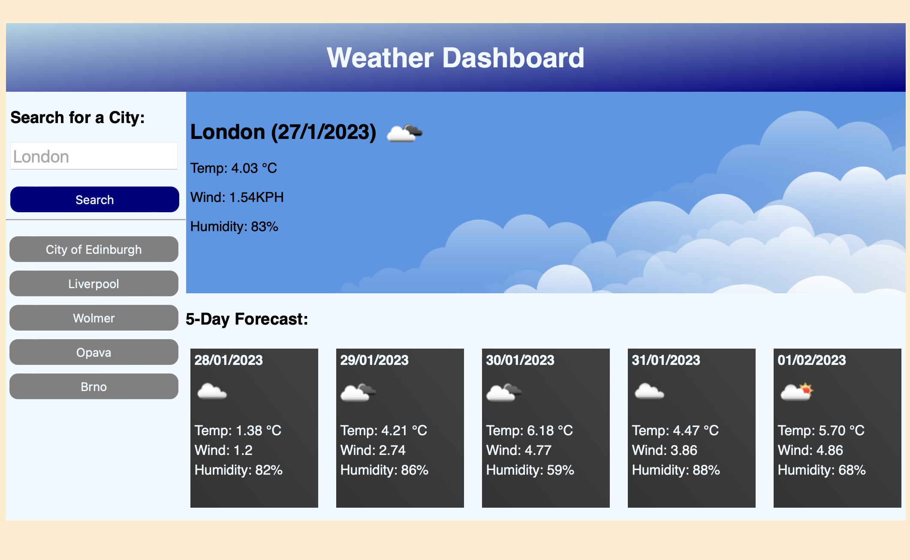
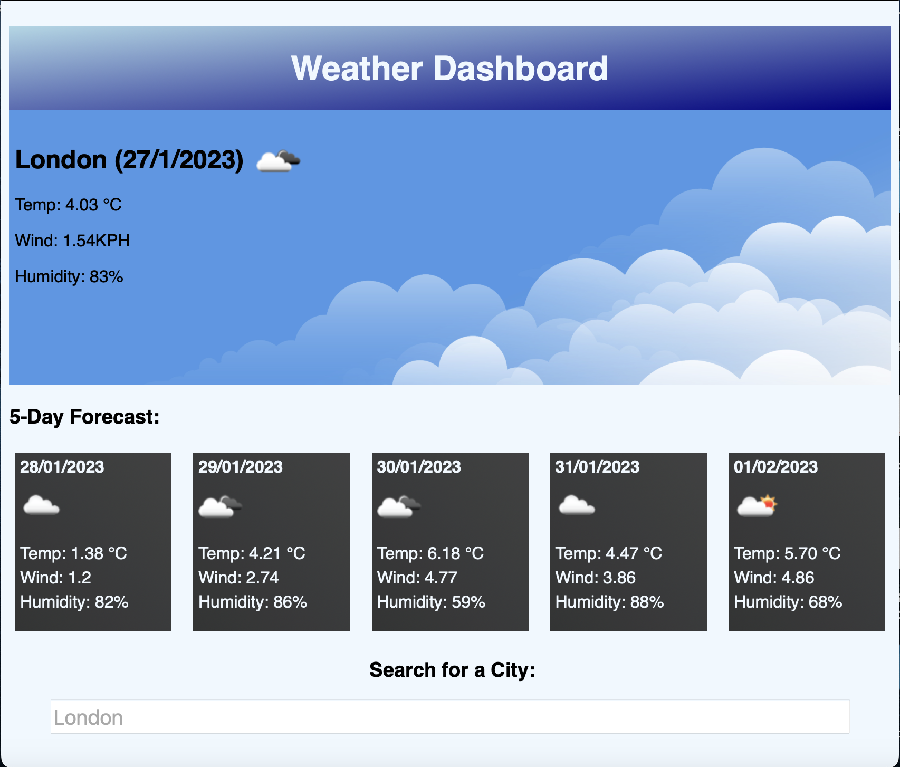

# weather-dashboard

## Task
This week's task was to build a weather dashboard that will run in the browser and feature dynamically updated HTML and CSS.

## Implementation
I've built this app from scratch. The responsive frontend uses vanilla CSS with media queries. The five day forecast divs are generated by javascript so I decided that when the page is first loaded it shows the forecast for London. The app makes API calls to 3 different URLs. 1 to retrieve coordinates of a city the user is searching for, 1 for current weather and 1 for 5 day forecast. If user inputs a string to which API call doesn't return any results the "No Result!" message is displayed. If user submits empty string or comma and possibly some other symbols the API call returns error and user is notified with "Wrong request!" message. I wanted to add an additional logic which would prevent the user from submitting these invalid requests but I don't know how many and which ones they are (probably more than empty string and ','). Cities that the user was searching for are stored in `localStorage`.

An option to delete specific history entries would be a nice addition but I didn't want to add unnecessary complexity to this project.

This app would work well in the UK as API calls return UTC times but will be off in different time zones. The task doesn't mention this so I left it as it is - but this is something that could be improved.

This app can be found here: https://michalous.github.io/weather-dashboard/